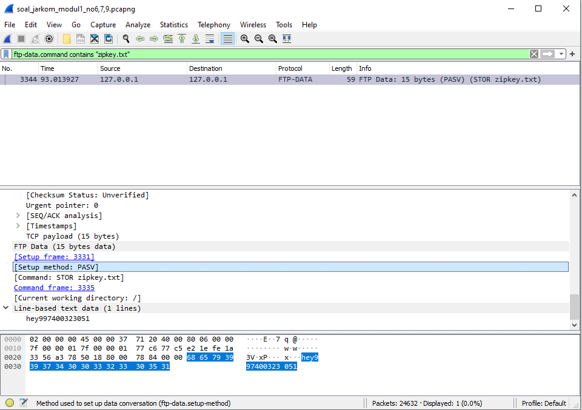

# Jarkom_Modul1_Lapres_D12
- Muhammad Ilham Bayhaqi - 05111840000069
- Clever Dicki Marpaung - 05111840000116

## A. Display Filter
1. Sebutkan webserver yang digunakan pada "testing.mekanis.me"!
2. Simpan gambar "Tim_Kunjungan_Kerja_BAKN_DPR_RI_ke_Sukabumi141436.jpg"!
3. Cari username dan password ketika login di "ppid.dpr.go.id"!
4. Temukan paket dari web-web yang menggunakan basic authentication method!
5. Ikuti perintah di aku.pengen.pw! Username dan password bisa didapatkan dari file .pcapng!
6. Seseorang menyimpan file zip melalui FTP dengan nama "Answer.zip". Simpan dan Buka file "Open This.pdf" di Answer.zip. Untuk mendapatkan password zipnya, temukan dalam file zipkey.txt (passwordnya adalah isi dari file txt tersebut).
7. Ada 500 file zip yang disimpan ke FTP Server dengan nama 1.zip, 2.zip, ..., 500.zip. Salah satunya berisi pdf yang berisi puisi. Simpan dan Buka file pdf tersebut.
Your Super Mega Ultra Rare Hint = nama pdf-nya "Yes.pdf"
8. Cari objek apa saja yang didownload (RETR) dari koneksi FTP dengan Microsoft FTP Service!
9. Cari username dan password ketika login FTP pada localhost!
10. Cari file .pdf di wireshark lalu download dan buka file tersebut!
clue: "25 50 44 46" 

## B. Capture Filter
11. Filter sehingga wireshark hanya mengambil paket yang mengandung port 21!
12. Filter sehingga wireshark hanya mengambil paket yang berasal dari port 80!
13. Filter sehingga wireshark hanya menampilkan paket yang menuju port 443!
14. Filter sehingga wireshark hanya mengambil paket yang berasal dari ip kalian!
15. Filter sehingga wireshark hanya mengambil paket yang tujuannya ke monta.if.its.ac.id!

## Jawaban
1. Webserver: ngingx/1.14.0 (Ubuntu)
   

2. Menggunakan display filter : http.request.uri contains "Tim", sehingga menampilkan paket yang menunjukkan link http dari images tersebut.
   
   
   
3. Menggunakan display filter : http.request.uri contains "login" && http.host == "ppid.dpr.go.id"
   

4. Menggunakan display filter : http.authbasic
   

5. Username: kakakgamtenk
   Password: hartatahtabermuda
   
   Setelah Username dan Password diinputkan maka akan muncul page berikut:
   

6. Untuk mencari password digunakan display filter : ftp-data.command contains "zipkey.txt"
   
   Password : hey997400323051   
   Untuk melakukan extract Answer.zip menggunakan display filter : ftp-data.command contains "Answer.zip" kemudian dilakukan TCP Stream dan save as dengan Raw.
   
   

7. Menggunakan display filter command: frame contains “Yes.pdf”
   
   Kemudian file didownload dalam bentuk file berekstensi zip
   
   Didalam file zip tersebut ada file pdf bernama “Yes.pdf”
   

8. Pertama-tama dilakukan pencarian server mana yang menggunakan koneksi Microsoft FTP Service dengan melakukan display filter sebagai berikut.
   
   Kemudian ditemukan bahwa ip host-nya adalah 198.246.117.106. Untuk mencari paket yang didownload digunakan display filter kembali : ftp.request.command == "RETR" && ip.dst_host == 198.246.117.106
   
   Objek yang didownload adalah file Readme

9. Menggunakan display filter command: ftp.request.command == USER || ftp.request.command == PASS
     
   
10. Menggunakan fitur “Find Packet”, kemudian ganti filter ke “Hex value” dan copy-paste clue pada soal ke tab pencarian hex value. Maka akan ada paket yang diblok
    
    
    Download file tersebut dan simpan dengan file berekstensi pdf.
    

11. Filter: port 21
   

12. Filter: src port 80
    
    
13. Filter: dst port 443
    
    
14. Filter: src host 192.168.0.6
    
    
15. Filter: dst host monta.if.its.ac.id
    
    
## Kendala
Sejauh ini belum ada kendala.
